# Реализация диффузионной модели из статьи [Denoising Diffusion Probabilistic Model (DDPM)](https://arxiv.org/abs/2006.11239)


Файлы [unet.py](unet.py), [ddpm.py](ddpm.py) содержат в себе реализацию нейронной сети основанной на UNet и диффузионной модели с использованием PyTorch.
В [train.py](train.py) содержится функция запуска обучения, для запуска из терминала написать ```python train.py```, произойдет обучение с ```T=500, n_feat=128```, результаты генерации после каждой эпохи будут в папке ```./DDMP_generated_samples_500_128```. График текущих значений функции потерь хранится в файлах типа ```loss_plot_{T}_{n_feat}.png``` и обновляется каждую эпоху обучения.

## Эксперименты
Я обучил модель на датасете рукописных цифр MNIST используя разное количество шагов ```T``` в диффузионном процессе и количество признаков ```num_features``` в блоке передачи контекста в UNet. Количество эпох обучения брал равным 20 и размер батча 256.

```T = 1000, num_features = 128```

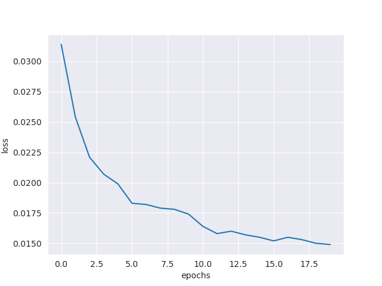

Сгенерированные моделью цифры от 1 до 10 после эпох 1, 5, 10, 15, 20:

1. 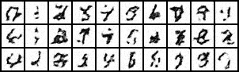
2. 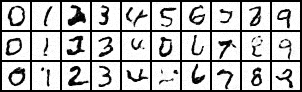
3. 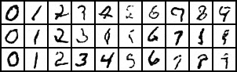
4. 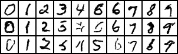
5. 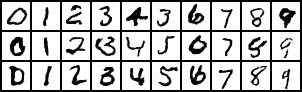


```T = 1000, num_features = 256```

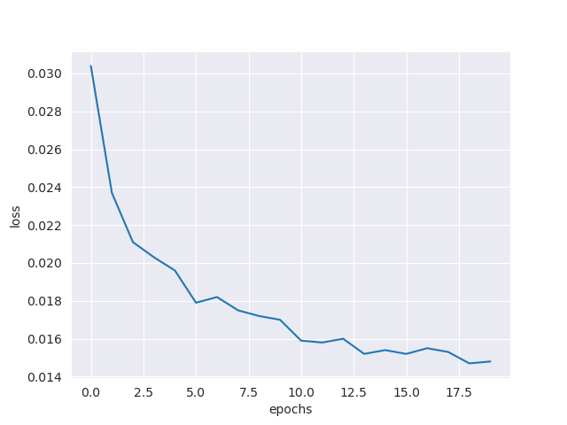

Сгенерированные моделью цифры от 1 до 10 после эпох 1, 5, 10, 15, 20:

1. 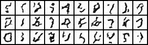
2. 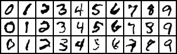
3. 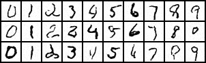
4. 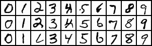
5. 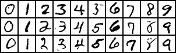

```T = 500, num_features = 128```

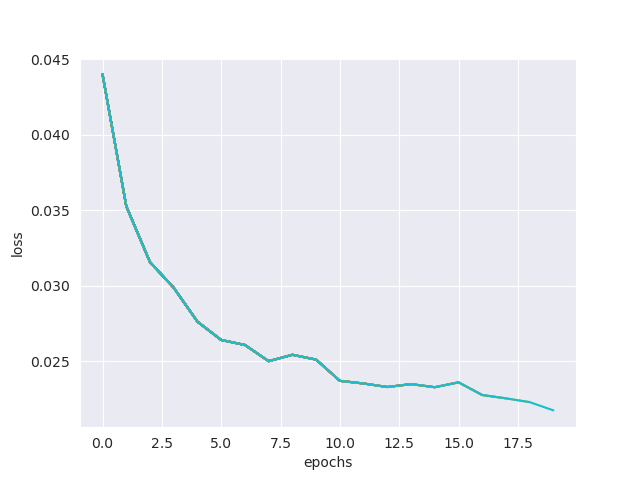

Сгенерированные моделью цифры от 1 до 10 после эпох 1, 5, 10, 15, 20:

1. 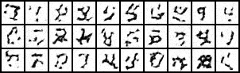
2. 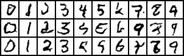
3. 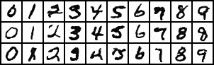
4. 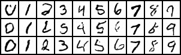
5. 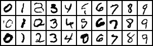

```T = 500, num_features = 256```

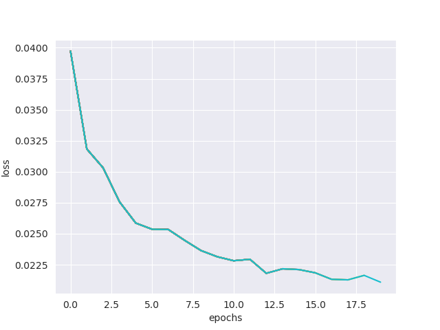

Сгенерированные моделью цифры от 1 до 10 после эпох 1, 5, 10, 15, 20:

1. 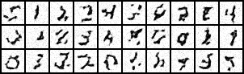
2. 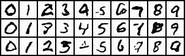
3. 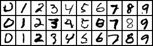
4. 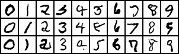
5. 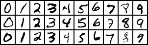

## Выводы
Как и предполагалось, при ```T = 1000``` ошибка полученная за 20 эпох оказалась ниже, чем при ```T = 500```, цифры при большем T также получились более четкими и реалистичными, но при этом время для генерации одного изображения значительно выросло. Большее количество параметров нейронной сети также положительно влияет на качество модели, но и увеличивает скорость обучения.
Можно заметить, что при небольшом количестве эпох на сгенерированных изображениях некоторые цифры выглядят как интерполяция двух похожих, например среднее между 6 и 8, между 0 и 8. Это еще раз подтверждает возможность создания реалистичной интерполяции двух объектов с помощью диффузионной модели.
При T = 1000 и количестве параметров 128 формы цифр даже после 20 эпохи остались немного кривыми, а при количестве параметров 256 уже выглядят практически идеально. Скорее всего это связано с тем, что для параметризации распределения 1000 шагов 128 слишком малое число параметров. Изображения сгенерированные с T=500 и количеством параметров 256 получились практически такого же качества, но при этом время для их генерации меньше, так что такая модель оптимальна.
